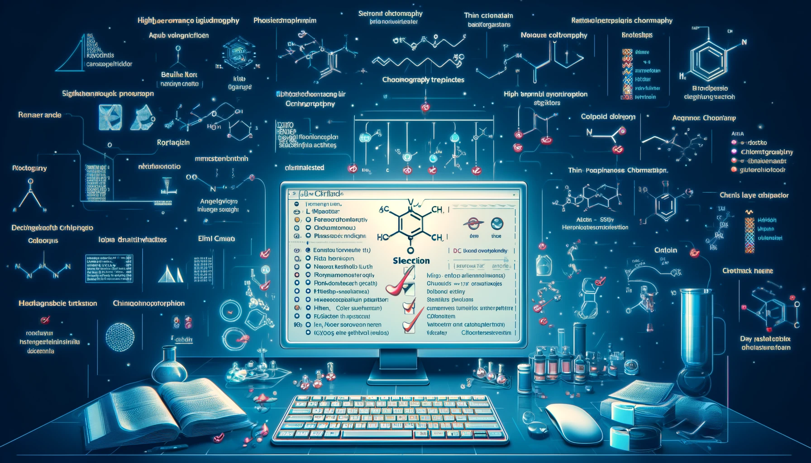

  

# chrfinder

## Project overview

Welcome to **Chrfinder**! This project automates the selection of the most suitable chromatography technique for separating and analyzing a given mixture of organic compounds. By simply providing the names of the molecules in the mixture, the code retrieves their physicochemical properties from various web sources and determines the optimal chromatography method based on these properties.

## ✅ Benefits

- **🚀 Efficiency**: Automates the property retrieval and decision-making process, saving time and reducing manual effort.
- **🎯 Accuracy**: Utilizes precise physicochemical data to ensure the most suitable chromatography technique is chosen.
- **🌐 Versatility**: Supports a wide range of organic compounds and chromatography methods.

## 🫱🏽‍🫲🏼 Contributing
Contributions are welcome! Please submit a pull request or open an issue to discuss any changes.
